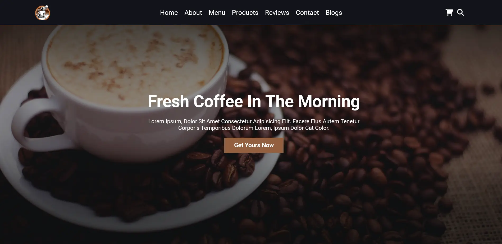

# Coffee-Shop-Website

### Design and Development of a Coffee Shop Website

Technologies used:
- HTML
- CSS
- HTML5
- CSS3
- JavaScript

Tools used:
- Visual Studio Code
- Brave Browser
- Firefox Browser
- Live Server
- Terminal
- Integrated Terminal
- Git
- GitHub
- Prettier

Preview

Link: &rarr; https://browse-coffee-shop.netlify.app/
