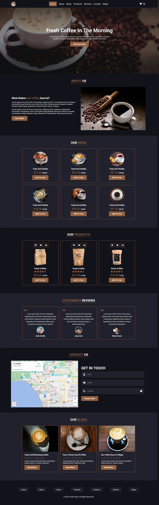

# Coffee-Shop-Website

### Design and Development of a Coffee Shop Website

Technologies used:

- HTML
- CSS
- HTML5
- CSS3
- JavaScript

Tools used:

- Visual Studio Code
- Brave Browser
- Firefox Browser
- Live Server
- Terminal
- Integrated Terminal
- Git
- GitHub
- Prettier
- Netlify to host and deploy for production
- cwebp for images with webp extension

Preview of home section

